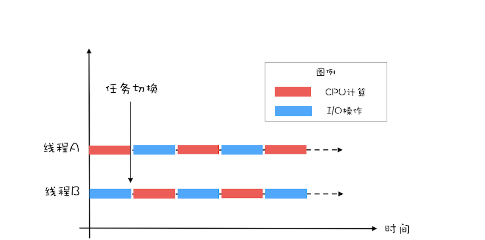

# 1.序言及全览
## 学习并发的原因
* 硬件驱动
* 人才稀缺


## 并发编程解决的核心问题
* 分工（如何高效地拆解任务并分配给线程）Fork/Join 框架
* 同步（指的是线程之间如何协作）CountDownLatch
* 互斥（保证同一时刻只允许一个线程访问共享资源）可重入锁

## 如何学习
* 跳出来，看全景，站在模型角度看问题（避免盲人摸象）
例如：synchronized、wait()、notify()不过是操作系统领域里管程模型的一种实现而已
* 钻进去，看本质
* 探究 Doug Lea 大师在J.U.C 包创造的章法
* 知识体系全景图


-------

# 2.并发问题总结
## 并发程序的背后
1. CPU 增加了缓存，以均衡与内存的速度差异；
2. 操作系统增加了进程、线程，以分时复用 CPU，进而均衡 CPU 与 I/O 设备的速度差异；
3. 编译程序优化指令执行次序，使得缓存能够得到更加合理地利用。


## 缓存导致的可见性问题

* 一个线程对共享变量的修改，另外一个线程能够立刻看到，我们称为**可见性**
* [代码示例](https://github.com/Fadezed/concurrency/blob/master/src/main/java/com/example/concurrency/visibility/Visibility.java)


## 线程切换带来的原子性问题
* 一个或者多个操作在 CPU 执行的过程中不被中断的特性称为**原子性**

* **时间片**概念
* 线程切换 ---〉提升cpu利用率。  tips:Unix系统因支持多进程分时复用而出名。
* 线程切换[代码示例](https://github.com/Fadezed/concurrency/blob/master/src/main/java/com/example/concurrency/contentSwitch/ContentSwitchTest.java)。
* 原子问题[代码示例](https://github.com/Fadezed/concurrency/blob/master/src/main/java/com/example/concurrency/atomic/AtomicCounter.java)


* count+=1 操作分析
    * 指令 1：需要把变量 count 从内存加载到 CPU的寄存器；
    * 指令 2：在寄存器中执行 +1 操作；
    * 指令 3：将结果写入内存（缓存机制导致可能写入的是 CPU 缓存而不是内存）。


## 编译优化带来的有序性问题

* 双重检查创建单例对象


```
public class Singleton {
  private static Singleton instance;
  private Singleton(){}
  public static Singleton getInstance(){
    //一重判断
    if (instance == null) {
      synchronized(Singleton.class) {
        //二重判断防止多线程同时竞争锁的情况多次创建
        if (instance == null)
          instance = new Singleton();
        }
    }
    return instance;
  }
}
```
* new 操作的顺序问题


-------
# 3.JAVA内存模型
## 按需禁用缓存以及编译优化 [代码来源](http://www.cs.umd.edu/~pugh/java/memoryModel/jsr-133-faq.html)

* ## volatile
    * [代码示例](https://github.com/Fadezed/concurrency/blob/master/src/main/java/com/example/concurrency/volatileExample/VolatileExample.java)

* ## synchronized
    * [代码示例](https://github.com/Fadezed/concurrency/blob/master/src/main/java/com/example/concurrency/synchronizedEx/SynchronizedExample.java)
    
    ```
    class X {
      // 修饰非静态方法 锁对象为当前类的实例对象 this
      synchronized void get() {
      }
      // 修饰静态方法 锁对象为当前类的Class对象 Class X
      synchronized static void set() {
      }
      // 修饰代码块
      Object obj = new Object()；
      void put() {
        synchronized(obj) {
        }
      }
    }  
    
    ```
* ## final

    * [代码示例](https://github.com/Fadezed/concurrency/blob/master/src/main/java/com/example/concurrency/finalEx/FinalExample.java)
    
    `修饰变量时，初衷是告诉编译器：这个变量生而不变。`
    
    ```
    final int x;
    // 错误的构造函数
    public FinalFieldExample() { 
      x = 3;
      y = 4;
      // 此处就是讲 this 逸出，
      global.obj = this;
    }

    ```

* ## Happens-Before六大规则
    1. **程序的顺序性规则**
    
     `程序前面对某个变量的修改一定是对后续操作可见的。`
    
    2. **volatile 变量规则**
    
     `对一个 volatile 变量的写操作， Happens-Before 于后续对这个 volatile 变量的读操作。`
     
    3. **传递性规则**
    `A Happens-Before B，且 B Happens-Before C，那么A Happens-Before C。`
      
    
    4. **管程（synchronized）中锁的规则**
        `对一个锁的解锁 Happens-Before 于后续对这个锁加锁`
        ```
        synchronized (this) { // 此处自动加锁
              // x 是共享变量, 初始值 =10
              if (this.x < 12) {
                this.x = 12; 
              }  
            } // 此处自动解锁
            
        ```

    5. **线程 start() 规则**
        `主线程 A 启动子线程 B 后，子线程 B 能够看到主线程在启动子线程 B 前的操作。`
        ```
        Thread B = new Thread(()->{
          // 主线程调用 B.start() 之前
          // 所有对共享变量的修改，此处皆可见
          // 此例中，var==77
        });
        // 此处主线程A对共享变量 var 修改
        var = 77;
        // 主线程启动子线程
        B.start();

        ```
        
    6. **线程 join() 规则**
        `主线程 A 等待子线程 B 完成（主线程 A 通过调用子线程B 的 join() 方法实现），当子线程 B 完成后（主线程 A 中 join() 方法返回），主线程能够看到子线程的操作。`
  
        ```
        Thread B = new Thread(()->{
          // 此处对共享变量 var 修改
          var = 66;
        });
        // 例如此处对共享变量修改，
        // 则这个修改结果对线程 B 可见
        // 主线程启动子线程
        B.start();
        B.join()
        // 子线程所有对共享变量的修改
        // 在主线程调用 B.join() 之后皆可见
        // 此例中，var==66

        ```
           
-------
# 4.JAVA线程的生命周期 
* [代码示例](https://github.com/Fadezed/concurrency/blob/master/src/main/java/com/example/concurrency/threadState/ThreadState.java)

## 通用的线程生命周期
* 初始状态

    `指的是线程已经被创建，但是还不允许分配 CPU 执行。这个状态属于编程语言特有的，不过这里所谓的被创建，仅仅是在编程语言层面被创建，而在操作系统层面，真正的线程还没有创建。`
* 可运行状态
    `指的是线程可以分配 CPU 执行。在这种状态下，真正的操作系统线程已经被成功创建了，所以可以分配 CPU 执行。`
* 运行状态
    `当有空闲的 CPU 时，操作系统会将其分配给一个处于可运行状态的线程，被分配到 CPU 的线程的状态就转换成了运行状态。`
* 休眠状态
    `运行状态的线程如果调用一个阻塞的 API（例如以阻塞方式读文件）或者等待某个事件（例如条件变量），那么线程的状态就会转换到休眠状态，同时释放 CPU 使用权，休眠状态的线程永远没有机会获得 CPU 使用权。当等待的事件出现了，线程就会从休眠状态转换到可运行状态。`
* 终止状态
    `线程执行完或者出现异常就会进入终止状态，终止状态的线程不会切换到其他任何状态，进入终止状态也就意味着线程的生命周期结束了。`


## Java 中线程的生命周期

* NEW（初始化状态） 
* RUNNABLE（可运行 / 运行状态)
* BLOCKED（阻塞状态）
* WAITING（无时限等待）
* TIMED_WAITING（有时限等待） 
* TERMINATED（终止状态）


### 线程转换条件
1. RUNNABLE - BLOCKED 
    * 线程等待synchronized隐式锁（线程调用阻塞式API依然是RUNNABLE状态）
2. RUNNABLE - WAITING
    * 获得synchronized隐式锁的线程，调用Object.wait();
    * Thread.join();
    * LockSupport.park();
3. RUNNABLE - TIMED_WAITING
    * Thread.sleep(long millis)
    * 获得 synchronized 隐式锁的线程调用 Object.wait(long timeout)
    * Thread.join(long millis)
    * LockSupport.parkNanos(Object blocker, long deadline)
    * LockSupport.parkUntil(long deadline)
4. NEW - RUNNABLE
    * Thread.start()
5. RUNNABLE - TERMINATED
    * run()执行完后自动转为 TERMINATED
    * stop()(@Deprecated 直接结束线程，如果线程持有ReentrantLock锁并不会释放)
    * interrupt()
        * 异常通知
        * 主动监测

-------
# 5.多线程以及线程数确定
## 多线程目的
* 降低**延迟**（发出请求到收到响应这个过程的时间；延迟越短，意味着程序执行得越快，性能也就越好。）
* 提高**吞吐量**（指的是在单位时间内能处理请求的数量；吞吐量越大，意味着程序能处理的请求越多，性能也就越好。）

## 多线程应用场景
* 优化算法
* 发挥硬件性能（CPU、IO）

### 多线程效果
* 单线程CPU和IO的利用率为50%

* 两个线程CPU和IO的利用率达到100%


## 线程数
* CPU 计算和 I/O 操作的耗时是 1:2

* 公式：
    * 单核CPU ：最佳线程数 =1 +（I/O 耗时 / CPU 耗时）
    * 多核CPU ：最佳线程数 =CPU 核数 * [ 1 +（I/O 耗时 / CPU 耗时）

-------
# 6. 若干反例


```
class SafeCalc {
  long value = 0L;
  long get() {
    synchronized (new Object()) {
      return value;
    }
  }
  void addOne() {
    synchronized (new Object()) {
      value += 1;
    }
  }
}

```

```
class Account {
  // 账户余额  
  private Integer balance;
  // 账户密码
  private String password;
  // 取款
  void withdraw(Integer amt) {
    synchronized(balance) {
      if (this.balance > amt){
        this.balance -= amt;
      }
    }
  } 
  // 更改密码
  void updatePassword(String pw){
    synchronized(password) {
      this.password = pw;
    }
  } 
}

```


```
void addIfNotExist(Vector v, 
    Object o){
  if(!v.contains(o)) {
    v.add(o);
  }
}

```

    


        
